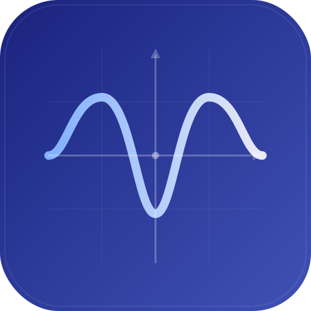
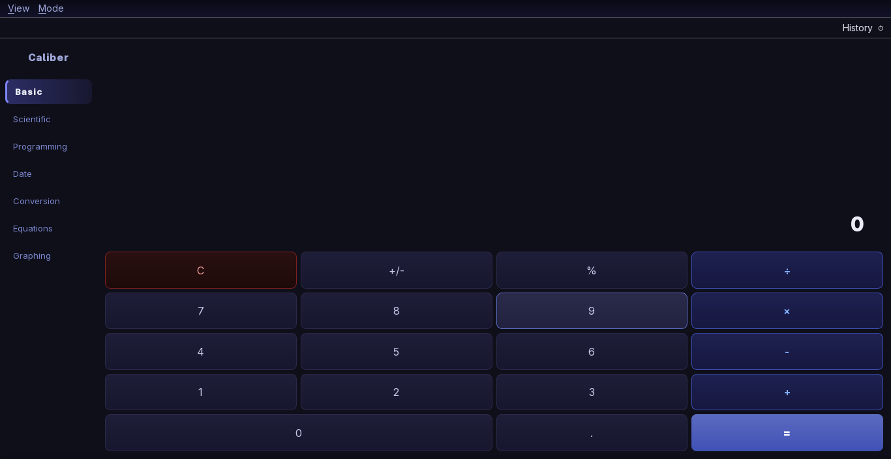
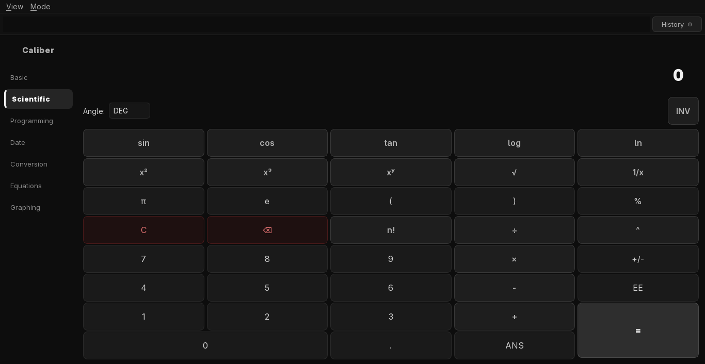
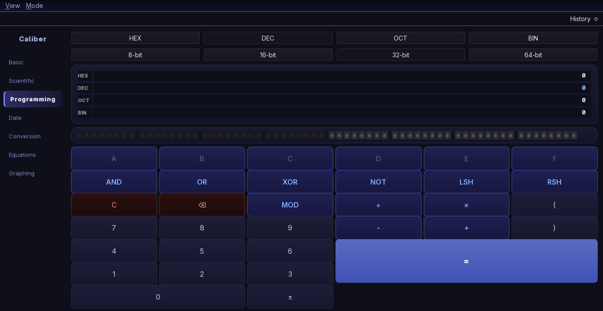
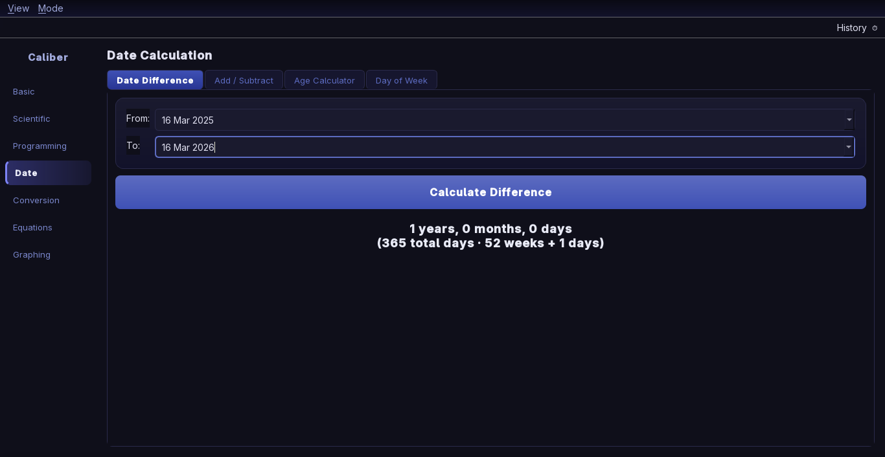
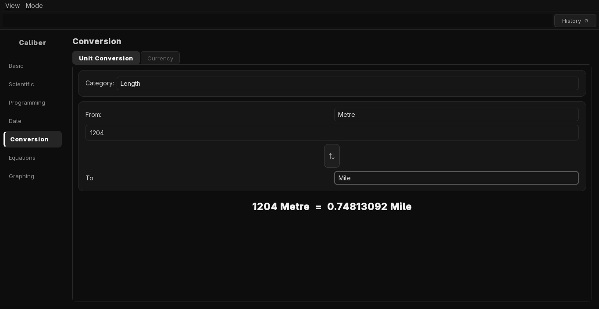
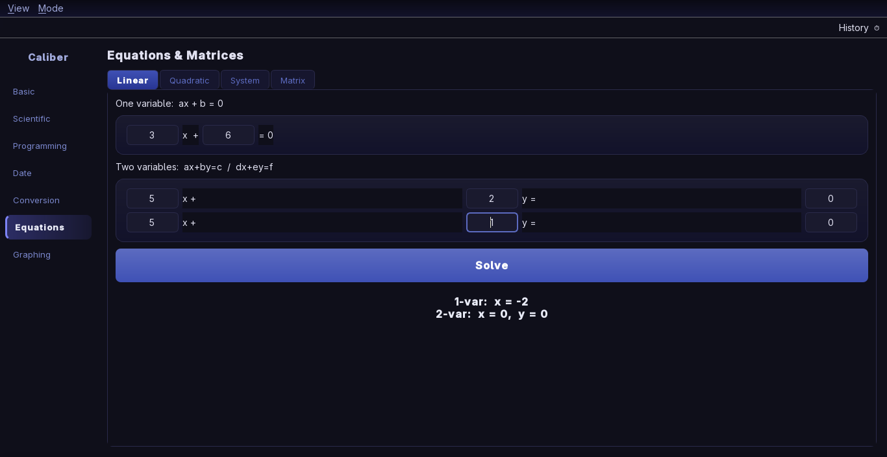
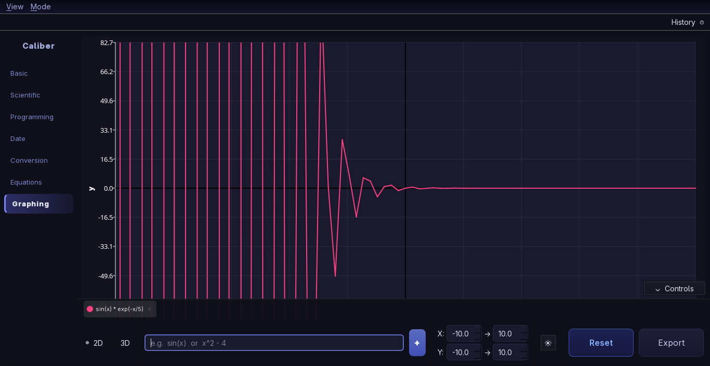
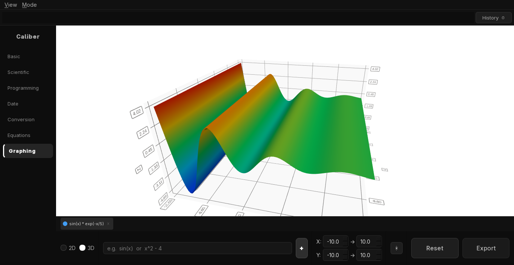

# Caliber

A graphical calculator built with C++ and Qt6. Covers every calculation mode you'd need — from basic arithmetic to function graphing — in a clean, themeable interface.



---

## Screenshots

| | |
|---|---|
|  |  |
|  |  |
|  |  |
|  |  |

---

## Modes

| Mode | Description |
|---|---|
| Basic | Arithmetic with live expression preview |
| Scientific | Trig, logarithms, powers, constants (π, e), DEG/RAD/GRAD |
| Programming | HEX/DEC/OCT/BIN, bitwise ops, 8–64 bit width, bit visualizer |
| Date | Date difference, add/subtract durations, age calculator, day of week |
| Conversion | 13 unit categories + live currency conversion via API |
| Equations | Linear, quadratic, system solver (Gaussian), matrix operations |
| Graphing | 2D function plotter, multiple functions, zoom/pan, export to image |

---

## Installation

Download the package for your platform from the [Releases](../../releases) page.

| Platform | Package | Install method |
|---|---|---|
| Ubuntu / Debian | `caliber-1.1.0.deb` | `sudo dpkg -i caliber-1.1.0.deb` |
| Fedora / RHEL | `caliber-1.1.0.rpm` | `sudo rpm -i caliber-1.1.0.rpm` |
| Arch Linux | `PKGBUILD` | `makepkg -si` |
| Any Linux | `caliber-1.1.0.tar.gz` | Extract and run |
| Any Linux (sandboxed) | `com.caliber.app.flatpak` | `flatpak install` |
| Windows | `Caliber-1.1.0-Windows-x64.zip` | Extract and run `caliber.exe` |
| macOS | `Caliber-1.1.0.dmg` | Open and drag to Applications |

---

### Linux — .deb (Ubuntu / Debian)

```bash
sudo dpkg -i caliber-1.1.0.deb
# install any missing Qt6 dependencies:
sudo apt-get install -f
```

### Linux — .rpm (Fedora / RHEL / openSUSE)

```bash
sudo rpm -i caliber-1.1.0.rpm
# or with dnf:
sudo dnf install caliber-1.1.0.rpm
```

### Linux — build from source

```bash
# Fedora / Ultramarine
sudo dnf install qt6-qtbase-devel qt6-qtcharts-devel qt6-qtdatavis3d-devel

# Ubuntu / Debian
sudo apt install qt6-base-dev qt6-charts-dev qt6-datavis3d-dev

mkdir build && cd build
cmake .. -DCMAKE_BUILD_TYPE=Release -DCMAKE_INSTALL_PREFIX=/usr
make -j$(nproc)
sudo make install
```

**Uninstall:** `sudo make uninstall` or remove `/usr/bin/caliber` manually.

### Linux — Arch / AUR

```bash
git clone https://github.com/imloafy/caliber
cd caliber/package
makepkg -si
```

### Linux — Flatpak (any distro)

```bash
flatpak install com.caliber.app-1.1.0.flatpak
# or from Flathub once published:
flatpak install flathub com.caliber.app
```

### Linux — tar.gz (portable, any distro)

```bash
tar -xzf caliber-1.1.0-Linux.tar.gz
cd caliber-1.1.0-Linux
sudo cp usr/bin/caliber /usr/local/bin/
sudo cp usr/share/applications/caliber.desktop /usr/share/applications/
sudo cp usr/share/icons/hicolor/scalable/apps/caliber.svg \
        /usr/share/icons/hicolor/scalable/apps/
```

---

### Windows

1. Download `Caliber-1.1.0-Windows-x64.zip` from [Releases](../../releases).
2. Extract the zip anywhere (e.g. `C:\Programs\Caliber`).
3. Run `caliber.exe` — no installation needed, all DLLs are included.

Optionally, right-click `caliber.exe` → Send to → Desktop to create a shortcut.

**Build installer from source** (requires Qt6 MSVC, CMake, Visual Studio 2019/2022, NSIS):

```bat
python windows\make_ico.py        :: one-time icon conversion (pip install cairosvg Pillow)
windows\build.bat C:\Qt\6.7.0\msvc2019_64
```

---

### macOS — .dmg

1. Download `Caliber-1.1.0.dmg` from [Releases](../../releases).
2. Open the `.dmg` and drag `Caliber.app` to your Applications folder.

**Build from source** (requires Qt6 via Homebrew, Xcode CLT):

```bash
brew install qt create-dmg librsvg
bash package/build_macos.sh
```

---

## Features

- 8 built-in themes: Light, Dark, Midnight Blue, Dracula, Nord, Monokai, Solarized Dark, Follow System
- Custom theme support — load any `.qss` file from disk via View → Theme → Load Custom Theme
- Settings persistence — remembers window size, last mode, and theme across restarts
- Keyboard shortcuts — `Ctrl+1` through `Ctrl+7` to switch modes instantly
- History panel — click any past calculation to restore it
- Currency conversion — fetches live rates from [open.er-api.com](https://open.er-api.com), caches offline
- Graph export — save plots as PNG or JPEG

---

## Keyboard Shortcuts

| Shortcut | Action |
|---|---|
| `Ctrl+1` – `Ctrl+7` | Switch to mode 1–7 |
| `Ctrl+H` | Toggle history panel |
| `Ctrl+Shift+S` | Theme: Follow System |
| `Ctrl+Shift+L` | Theme: Light |
| `Ctrl+Shift+D` | Theme: Dark |
| `Enter` | Calculate |
| `Backspace` | Delete last character |
| `Escape` | Clear |

---

## Stack

- C++17
- Qt6 (Widgets · Charts · Network)
- CMake
