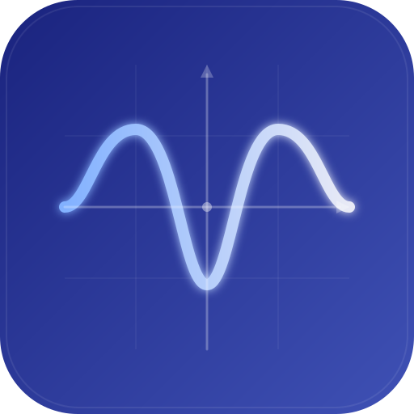

# Caliber

A graphical calculator built with C++ and Qt6. Covers every calculation mode a STEM student needs — from basic arithmetic to university-level solvers across 22 modes.



---

## Modes

| Mode | Description |
|---|---|
| Basic | Arithmetic with live expression preview |
| Scientific | Trig, logarithms, powers, constants (π, e), DEG/RAD/GRAD |
| Programming | HEX/DEC/OCT/BIN, bitwise ops, 8–64 bit width, bit visualizer |
| Date | Date difference, add/subtract durations, age calculator, day of week |
| Conversion | 13 unit categories + live currency conversion via API |
| Equations | Linear, quadratic, system solver (Gaussian), matrix operations |
| Graphing | 2D/3D plotter, polar/parametric, zoom/pan/trace, integral shading, derivative overlay, intersections |
| Statistics | Descriptive stats, distributions, hypothesis testing, regression, ANOVA, chi-square, histogram |
| Calculus | Symbolic differentiation, integration (single/double/triple), limits, Taylor series, root finder |
| Financial | Compound interest, loans, NPV/IRR, percentage calculations |
| Number Theory | Primes, GCD/LCM, modular arithmetic, base conversion, sequences |
| Electrical | Ohm's law, RLC circuits, voltage dividers, op-amps, dB, phasors, power factor |
| Digital Logic | Truth tables, K-maps, number systems, flip-flops, adders, MUX/DEMUX, IEEE 754 |
| Vectors | Arithmetic, dot/cross products, magnitude, angle, projection, line/plane equations |
| Physics | Kinematics, Newton's laws, energy, projectile motion, waves, thermodynamics, electrostatics |
| Chemistry | Molar mass, ideal gas law, pH, dilution, thermochemistry |
| Civil/Mech | Beam analysis, stress/strain, fluid mechanics, heat transfer, gears |
| Advanced Math | Complex numbers, linear algebra, series, triangle solver, polynomials, set theory |
| Discrete Math | Graph theory (BFS/DFS/Dijkstra), combinatorics, relations, recurrence, Boolean algebra |
| MCS | Asymptotic analysis, Master Theorem, floating point, formal logic, hashing |
| Signal Processing | DFT, filter design, sampling/Nyquist, convolution, transfer functions |
| Control Systems | Transfer functions, Routh-Hurwitz, PID tuning, steady-state error, state space |

---

## Features

### Solvers
- Step-by-step breakdowns across multiple modes (equations, calculus, statistics, vectors, etc.)
- Keyboard input — type directly using keyboard/numpad in Basic, Scientific, and Programming modes
- Live expression preview — see results as you type

### Graphing
- 2D: Multiple functions, zoom/pan/trace, derivative overlay (f'), integral shading, intersection finder
- 3D: Surface plotter (requires OpenGL), auto-rotation, multiple surfaces
- Polar and parametric plotting modes
- Export plots as PNG/JPEG

### Themes
- 9 built-in themes: Light, Dark, Midnight, Dracula, Nord, Monokai, Solarized, High Contrast, Follow System
- **Custom Gradient Theme** — pick any two colors, auto-derives all UI colors with luminance-based contrast
- Community themes — drop `.qss` files in `~/.config/Caliber/themes/`
- Accent color override via View menu

### Interface
- Resizable sidebar — drag to resize, shows full mode names
- History panel — search, filter, pin entries, export to TXT/CSV
- Formula Book — searchable reference with ~80 formulas across all modes
- Per-mode formula filtering — shows only formulas relevant to current mode
- Global solver search bar — jump to any mode+tab instantly
- Smooth mode transitions — cross-fade animation between modes
- Font size control — 10–18pt, persisted in settings

---

## Installation

Download the package for your platform from the [Releases](../../releases) page.

| Platform | Package | Install method |
|---|---|---|
| Ubuntu / Debian | `caliber-2.0.0.deb` | `sudo dpkg -i caliber-2.0.0.deb` |
| Fedora / RHEL | `caliber-2.0.0.rpm` | `sudo rpm -i caliber-2.0.0.rpm` |
| Arch Linux | `PKGBUILD` | `makepkg -si` |
| Any Linux | `caliber-2.0.0.tar.gz` | Extract and run |
| Windows | `Caliber-2.0.0-Setup.exe` | Run installer |
| Windows (portable) | `Caliber-2.0.0-Windows-x64.zip` | Extract and run `caliber.exe` |
| macOS | `Caliber-2.0.0.dmg` | Open and drag to Applications |

---

### Linux — build from source

```bash
# Fedora / Ultramarine
sudo dnf install qt6-qtbase-devel qt6-qtcharts-devel qt6-qtdatavis3d-devel

# Ubuntu / Debian
sudo apt install qt6-base-dev qt6-charts-dev

mkdir build && cd build
cmake .. -DCMAKE_BUILD_TYPE=Release -DCMAKE_INSTALL_PREFIX=/usr
cmake --build . --parallel $(nproc)
sudo cmake --install .
```

### Windows — build from source

```bat
windows\build.bat C:\Qt\6.8.0\msvc2019_64
```

### macOS — build from source

```bash
brew install qt create-dmg librsvg
bash package/build_macos.sh
```

---

## Keyboard Shortcuts

| Shortcut | Action |
|---|---|
| `Ctrl+1` – `Ctrl+7` | Switch to mode 1–7 |
| `Ctrl+H` | Toggle history panel |
| `Ctrl+F` | Toggle formula book |
| `Ctrl+Shift+S` | Theme: Follow System |
| `Ctrl+Shift+L` | Theme: Light |
| `Ctrl+Shift+D` | Theme: Dark |
| `Enter` | Calculate |
| `Backspace` | Delete last character |
| `Escape` | Clear |

---

## Stack

- C++17
- Qt6 (Widgets · Charts · DataVisualization · Network)
- CMake 3.16+

---

## License

See [LICENSE](LICENSE).
